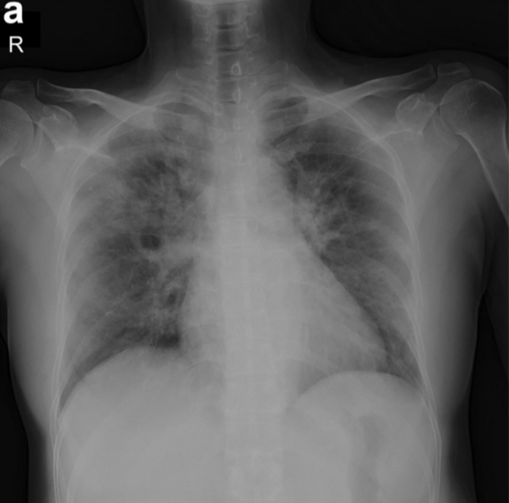
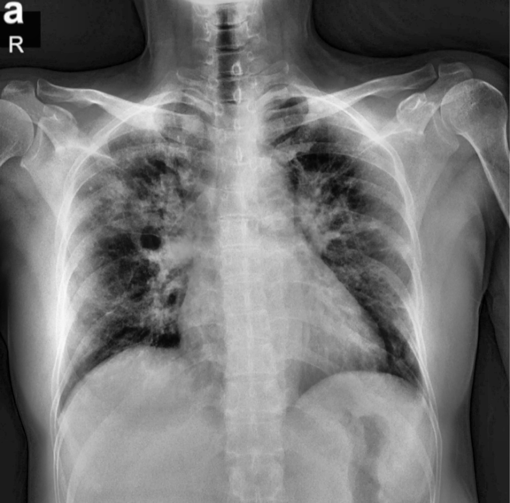
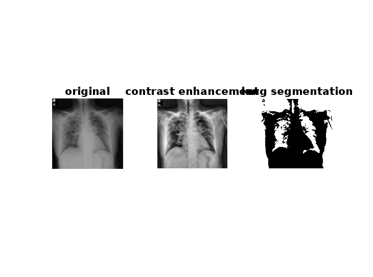

# 🫁 Lung Segmentation from Chest X-ray using MATLAB

 **Select Language:**  
[🇩🇪 Deutsch](README_DE.md) | [🇸🇦 العربية](README_AR.md)

---

##  Overview

This project demonstrates how to segment lungs from a chest X-ray image using a simple thresholding algorithm in MATLAB.

It includes the following steps:
- Reading a chest X-ray image
- Converting to grayscale
- Enhancing contrast
- Segmenting the lungs using global thresholding
- Inverting the binary mask
- Visualizing and saving the results

---

##  Project Structure

LungSegmentationMATLAB/
├── README.md
├── README_AR.md
├── README_DE.md
├── lung_segmentation.m
├── chest_xray.jpg
├── original_gray.png
├── enhanced_contrast.png
├── lung_segmented.png
├── comparison.png

---

##  Steps Performed

1. Read the chest X-ray image.
2. Convert it to grayscale if needed.
3. Enhance the contrast using `adapthisteq`.
4. Compute global threshold using `graythresh`.
5. Apply `imbinarize` to create binary segmentation.
6. Invert the binary image to highlight the lungs.
7. Display the original, contrast-enhanced, and segmented images.
8. Save the results as PNG images.

---

##  Results Preview

### Original grayscale image:

### Contrast-enhanced image:

### Lung segmentation result:

### Combined comparison:

---

##  Medical Value

This segmentation process helps:
- Improve visual clarity for physicians
- Preprocess images for AI diagnosis (e.g., pneumonia, COVID-19, cancer)
- Remove background noise from ribs and soft tissues
- Support automated detection of lung diseases

---

##  Skills Applied

- MATLAB
- Image contrast enhancement
- Thresholding and segmentation
- Medical image analysis
- Project documentation

---

##  Ready for Future Improvements

- Use `activecontour` or `regionprops` for more accurate lung boundaries
- Work with DICOM medical formats directly
- Integrate with CNN-based diagnostic models for classification 

