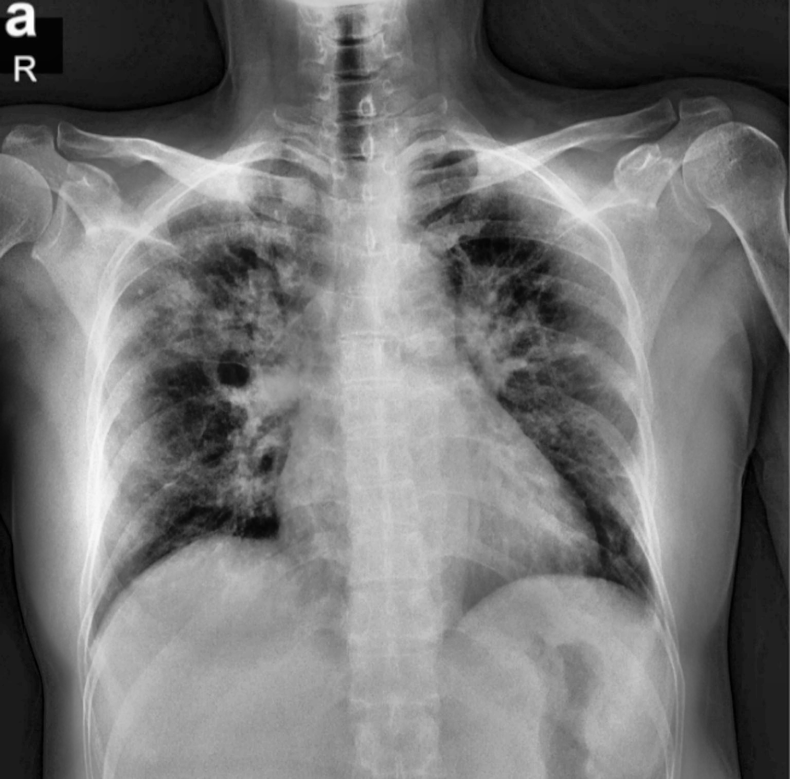
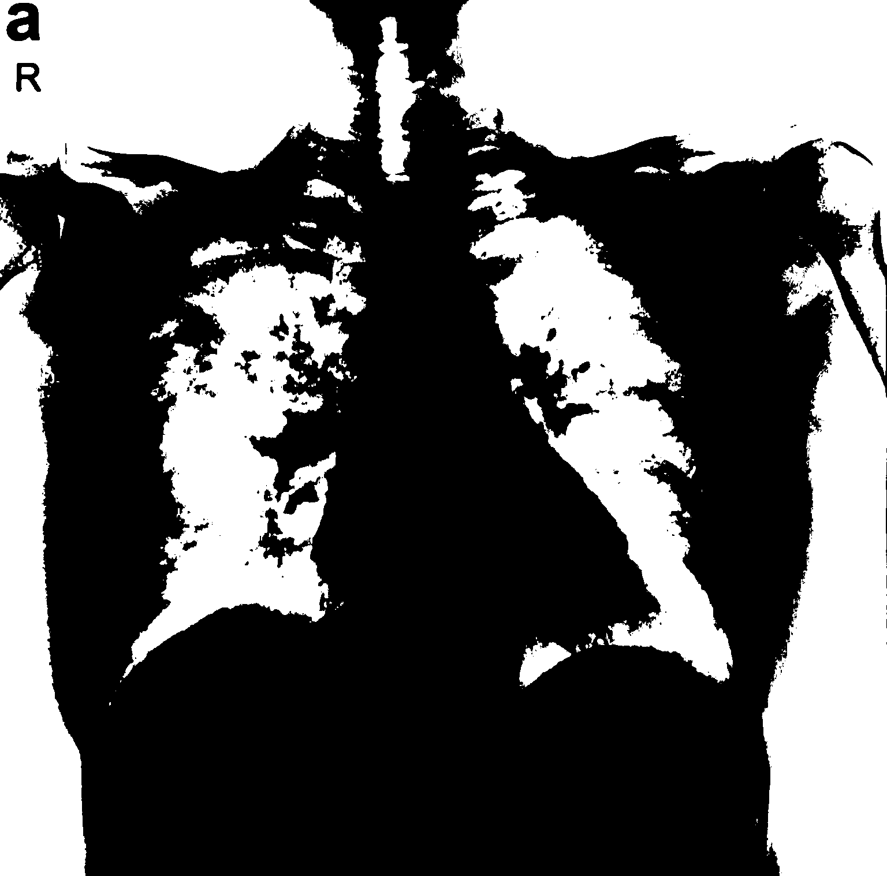

# 🫁 تقسيم الرئتين من صورة أشعة الصدر باستخدام MATLAB

🌐 اختيار اللغة:  
[🇺🇸 English](README.md) | [🇩🇪 Deutsch](README_DE.md) | [🇸🇦 العربية](README_AR.md)

---

## 📌 نظرة عامة

هذا المشروع يوضح كيفية استخدام MATLAB لتقسيم الرئتين من صورة أشعة الصدر باستخدام خوارزمية Threshold بسيطة.

يتضمن الخطوات التالية:
- قراءة صورة الأشعة
- تحويلها إلى تدرج رمادي
- تحسين التباين
- تطبيق تقسيم الرئة باستخدام Threshold
- عكس صورة التقسيم
- عرض الصور وحفظ النتائج

---

## 📂 هيكل المشروع

LungSegmentationMATLAB/
├── README.md
├── README_AR.md
├── README_DE.md
├── lung_segmentation.m
├── chest_xray.jpg
├── original_gray.png
├── enhanced_contrast.png
├── lung_segmented.png
├── comparison.png

---

## 🧠 الخطوات المنفذة

1. قراءة صورة الأشعة.
2. تحويلها إلى تدرج رمادي إذا كانت ملونة.
3. تحسين التباين باستخدام adapthisteq.
4. حساب Threshold باستخدام graythresh.
5. استخدام imbinarize لتوليد صورة ثنائية.
6. عكس الصورة الثنائية لعزل الرئتين.
7. عرض الصور: الأصلية، المحسنة، والمقسّمة.
8. حفظ النتائج بصيغة PNG.

---

## 🖼 عرض النتائج

### الصورة الرمادية الأصلية:

### الصورة بعد تحسين التباين:

### نتيجة تقسيم الرئتين:

### المقارنة الكاملة:

---

## 🏥 الفائدة الطبية

تساعد هذه العملية في:
- تحسين وضوح الرؤية للأطباء
- تحضير الصور للذكاء الاصطناعي لتشخيص الأمراض (الالتهاب الرئوي، كوفيد-19، السرطان)
- إزالة الضوضاء من العظام والأنسجة
- دعم اكتشاف أمراض الرئة تلقائيًا

---

## 🧠 المهارات المستخدمة

- MATLAB
- تحسين التباين
- تقسيم الصور الطبية
- معالجة الصور
- توثيق المشروع

---

## ✅ جاهز للتطوير مستقبلاً

- استخدام activecontour أو regionprops للحصول على تقسيم أدق
- العمل مع ملفات DICOM الطبية
- دمج المشروع مع شبكات CNN لتشخيص آلي متقدم
