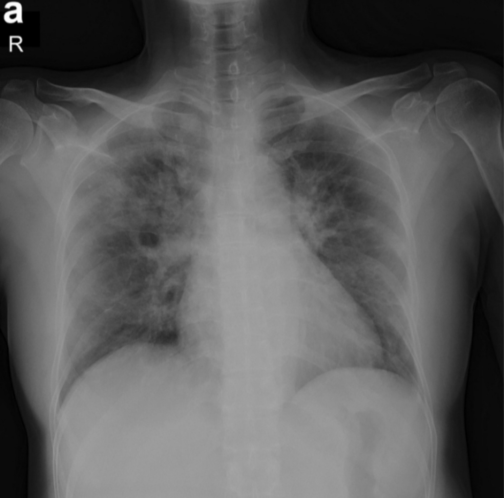
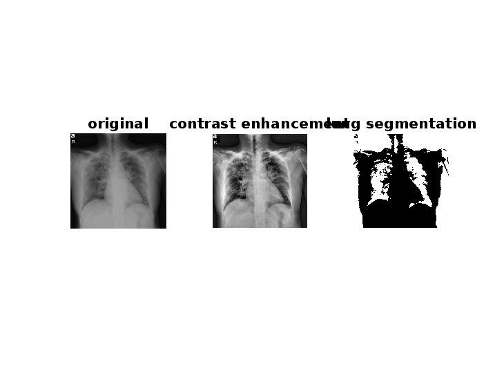

# 🫁 Lungen-Segmentierung aus Thorax-Röntgenbild mit MATLAB

🌐 **Sprache wählen:**  
[🇺🇸 Englisch](README.md) | [🇸🇦 Arabisch](README_AR.md)

---

## 📌 Übersicht

Dieses Projekt demonstriert, wie man mit einem einfachen Thresholding-Algorithmus in MATLAB die Lunge aus einem Thorax-Röntgenbild segmentiert.

Die folgenden Schritte werden durchgeführt:
- Röntgenbild einlesen
- Umwandlung in Graustufen
- Kontrasterhöhung
- Segmentierung der Lunge mittels globalem Threshold
- Invertierung der binären Maske
- Visualisierung und Speicherung der Ergebnisse

---

## 📂 Projektstruktur

LungSegmentationMATLAB/  
├── README.md  
├── README_AR.md  
├── README_DE.md  
├── lung_segmentation.m  
├── chest_xray.jpg  
├── original_gray.png  
├── enhanced_contrast.png  
├── lung_segmented.png  
├── comparison.png  

---

## 🧠 Durchgeführte Schritte

1. Röntgenbild einlesen  
2. In Graustufen umwandeln (falls nötig)  
3. Kontrasterhöhung mit `adapthisteq`  
4. Berechnung des globalen Thresholds mit `graythresh`  
5. Anwendung von `imbinarize` zur binären Segmentierung  
6. Invertierung des binären Bildes zur Hervorhebung der Lunge  
7. Anzeige und Speicherung der Ergebnisse  

---

## 🖼️ Ergebnisvorschau

### Originalbild in Graustufen:

### Kontrastverstärktes Bild:

### Segmentiertes Lungenbild:

### Vergleich (Vorher-Nachher):

---

## 🏥 Medizinischer Nutzen

Diese Segmentierung hilft:
- Die visuelle Klarheit für Ärzte zu verbessern  
- Bilder für KI-Diagnosemodelle vorzubereiten (z. B. Pneumonie, COVID-19, Tumore)  
- Hintergrundrauschen durch Rippen und Weichteile zu entfernen  
- Die automatische Erkennung von Lungenerkrankungen zu unterstützen  

---

## 🧠 Angewandte Kenntnisse

- MATLAB  
- Bildkontrasterhöhung  
- Thresholding und Segmentierung  
- Analyse medizinischer Bilder  
- Projektdokumentation  

---

## ✅ Mögliche Verbesserungen

- Verwendung von `activecontour` oder `regionprops` für präzisere Lungenränder  
- Direkte Verarbeitung von DICOM-Bildern  
- Integration mit CNN-basierten Diagnosemodellen zur Klassifikation  
